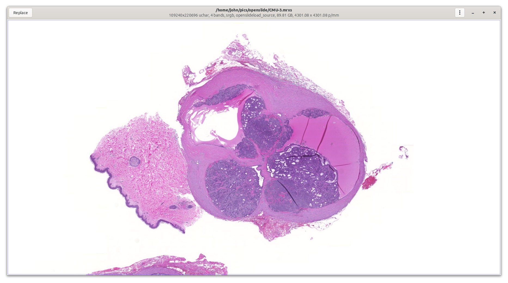
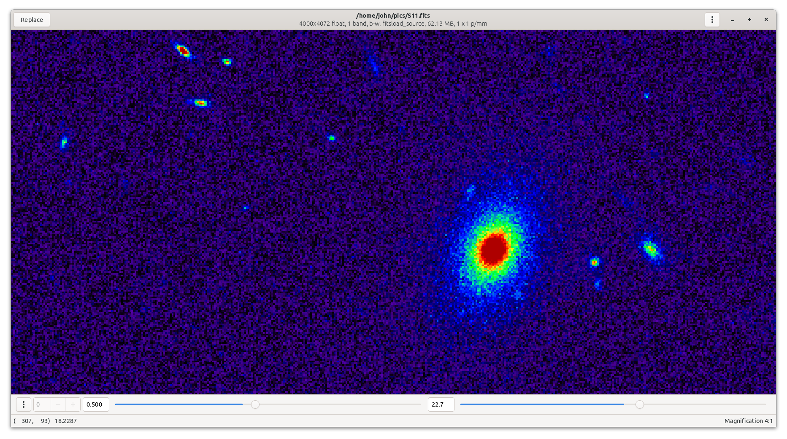

# vipsdisp

This is a C program to display an image with libvips and gtk+4. This is
supposed to be a slightly useful image viewer. It can display huge (many,
many GB) images quickly and without using much memory. It supports many
scientific and technical image formats, including TIFF, WEBP, JP2K, JXL, PNG, 
JPEG, SVS, MRXS, OpenEXR, GIF, PDF, SVG, FITS, Matlab, NIfTI, Analyze, etc. It
supports pixel types from 1 bit mono to 128-bit double precision complex.

All of the UI can make finding the details of image display in the sourcecode
difficult. See [vipsdisp-tiny](https://github.com/libvips/vipsdisp-tiny) for
a minimal example --- that's a libvips image viewer in about 300 lines of
very commented C.

## Screenshots

It all works, though see the TODO list below.

[](images/shot1.png)

[](images/shot2.png)

[](images/shot3.png)

## Install

This program is on flathub, see:

https://flathub.org/apps/search/org.libvips.vipsdisp

Just click "install".

## Features

* It supports many scientific and technical image formats, including TIFF,
  WEBP, JP2K, JXL, PNG, JPEG, SVS, MRXS, OpenEXR, GIF, PDF, SVG, FITS,
  Matlab, NIfTI, Analyze, etc. It supports many numeric pixel types, any
  number of image bands, many colour spaces.

* It has Save as, so you can use it for image format conversion. Though
  there's currently no GUI for save options, sadly.

* It doesn't need to keep the whole image in memory. It will only read parts 
  that it needs for display, and it understands most pyramidal image formats.
  This means you can open and view huge images quickly.

* It has threaded, asynchronous image repaint, so display pixels are
  computed in the background by a pool of workers and tiles are rendered to
  the screen as they are finished. The interface stays live even under very
  heavy load.

* Select *Display control bar* from the top-right menu and a useful
  set of visualization options appear. It supports three main display modes:
  Toilet roll (sorry), Multipage and Animated.

* In Toilet roll mode, a multi-page image is presented as a tall, thin strip
  of images. In Multipage, you see a single page at a time, with a page-select
  spinner (you can also use the `<` and `>` keys to flip pages). In animated
  mode, pages flip automatically on a timeout. 

* You can select falsecolour and log-scale filters, useful for many scientific
  images. Scale and offset sliders let you adjust image brightness to see into
  darker areas (useful for HDR and many scientific images).

* It uses the gtk4 GUI toolkit, so the interface is fast, attractive
  and nicely animated.

## Build from source

You need gtk4. On Ubuntu 21.04, build with:

```
$ cd gtk
$ git checkout 4.3.2
$ meson _build . \
  --prefix=/home/john/vips \
  --libdir=/home/john/vips/lib \
  -Dwayland-backend=false
$ cd _build
$ ninja
$ ninja install
$ export GSETTINGS_SCHEMA_DIR=/home/john/vips/share/glib-2.0/schemas
$ gtk4-demo
```

Disable wayland, since 21.04's wayland is too old. Use 4.3.2 or you'll need
a new pango.

Then for vipsdisp:

```
$ ./autogen.sh --prefix=/home/john/vips 
$ make
$ make install
$ export GSETTINGS_SCHEMA_DIR=/home/john/vips/share/glib-2.0/schemas
$ ./vipsdisp ~/pics/k2.jpg
```

## Shortcuts

* Cursor keys to scroll around
* Cursor keys plus shift to move by a screen size
* Cursor keys plus ctrl to move to image edges
* Number keys to pick a particular magnification
* Ctrl + number keys to pick a particular zoom out
* 0 for best fit
* i, + / o, - to zoom in and out
* ctrl-, ctrl-. prev page, next page
* Mouse drag to pan
* Mousewheel to zoom
* Mousewheel + shift/ctrl to pan
* ^O replace image
* ^N new viewer
* ^D duplicate view
* F11 fullscreen

## Structure

* `Imagedisplay` is a `GtkDrawingArea` subclass that paints a `VipsImage`. It
  implements a scrollable interface. You can use this as an image view
  widget in your own code.

* `Conversion` is a GObject which manages the image that is being
  displayed. Set things like magnification, file, scale, offset etc. on
  this and the display will update automatically.

* `Conversionview` is the view for the conversion model (it's the display
  control bar).

* `Imagewindow` is a GtkWindow that contains an `Imagedisplay` and a
  `Conversionview` and adds a lot of navigation stuff. It uses the scolled
  window `GtkAdjustment` to slide `Imagedisplay` around, and sets properties
  of `Conversion` to zoom etc.

* `disp` is the `main()`, `VipsdispApp` is a `GtkApplication` subclass

* The UI layout is in the `gtk/*.ui` xml.

## TODO

- image sniffing needs refactoring, it's too complex and fragile

- ome-tiff pyr load, rapid zoom in and out, see a lot of errors

  same for other subifd pyr?

- add imagemagick to get dicom loader?

- once the framerate drops below 30 fps, the final paint is almost always
  interrupted by the arrival of the next frame, appearing to lock the display

  only schedule the next paint when the current one finishes?

  see `conversion_page_flip()` -- try: 
  
  1. start a timer

  2. set page flip going

  3. in repaint, set an idle task when we paint the final tile (how do we
     know? no idea)

  4. idle task checks the timer, computes elapsed time, sets the next page
     flip timeout for (delay - time elapsed)

     could skip frames for very slow updates? track `t` rather than having a
     timeout, and pick a frame from that?

- improve upscale for buffer rebuild to reduce percieved flicker

- auto reload on file change, or support F5 for reload?

- load image with long progress bar, ^D during load, progress bar stops
  updating

- header display

- load options? save options? eg. load SVG at $x DPI

- perhaps convert to scrgb before scale/offet? we'd maybe keep float precision
  then?

## flatpak

Add the `flathub` repo:

```
flatpak remote-add --if-not-exists \
  flathub https://flathub.org/repo/flathub.flatpakrepo
```

Install the gtk4 SDK:

```
flatpak install org.gnome.Sdk//41
```

Build:

```
flatpak-builder --force-clean build-dir org.libvips.vipsdisp.json
```

Install the binary you just made to your local account and try running it:

```
flatpak-builder --force-clean --user --install build-dir org.libvips.vipsdisp.json
flatpak run org.libvips.vipsdisp ~/pics/k2.jpg
```

Force a complete redownload and rebuild (should only rarely be necessary) with:

```
rm -rf .flatpak-builder
```

Check the files that are in the flatpak you built with:

```
ls build-dir/files
```

Uninstall with:

flatpak uninstall vipsdisp
```

## Notes on flatpak build process

- niftiio is annoying to build, skip it.

- we skip imagemagick as well, too huge

## Packaging for flathub

Install the appdata checker:

```
flatpak install flathub org.freedesktop.appstream-glib
flatpak run org.freedesktop.appstream-glib validate org.libvips.vipsdisp.appdata.xml
```
